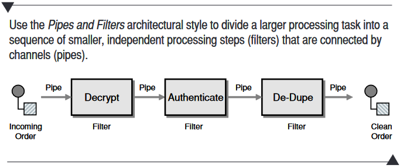
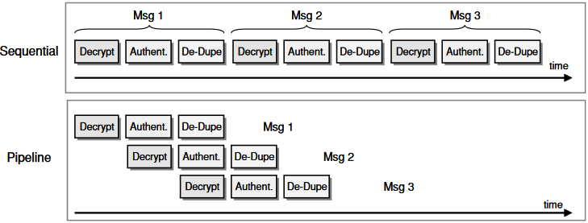
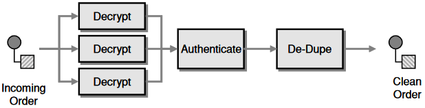

# Assignment 7

## _Read [Chapter 3: Messaging Systems](https://www.enterpriseintegrationpatterns.com/docs/EnterpriseIntegrationPatterns_HohpeWoolf_ch03.pdf) and create a glossary of at least ten terms, related to System Integration, which you find essential._

&nbsp;

### Abstract concepts

1. _**Messaging system**_ A set of connections that enables applications to communicate by transmitting messages in a predetermined, predictable way.

2. _**Loose coupling:**_ The messaging system acts as a mediator or middle-layer between communicating applications.

3. _**Asynchronous communication:**_ Communicating applications do not even have to be running at the same time.

### Basic concepts (see image below)

1.  _**Channel:**_ A virtual pipe through which the communicating applications transmit data.\
    A sender will not know who gets the message but can be sure, that the receiver is interested because a messaging system has several channels for particular messages.\
    There are two types of message channels:

        * Point-to-point
        * Publish-subscribe

Don't mix datatypes on the same channel, use separate datatype channels instead.

2. _**Message:**_ An atomic packet of data that is transmitted on a channel. Messages are marshalled by the sending application and unmarshalled by the receiver. A message consists of a header and body part. Header has meta-data regarding origin, destination and so on. The body part is irrelevant to the messaging system.\
   Use an apropriate message type that suits its purpose:
   _ Command message: invoke a procedure in another application.
   _ Document message: Pass a set of data to another application.
   _ Event message: To notify another application.
   _ Request-reply: To ask another application.

3. _**Pipes and filters (transformation):**_ If work needs to be done to the message being transmitted, pipes and filters can be set up to perform this. E.g. if the sender sends json and the receiver expects xml, a transformation of data needs to be carried out before the message can be passed on.\
The pipe is the connection between filters. A filter is an individual processing step of a larger processing task. A filter receives and transmits messages on ports.\

4. _**Routing:**_ Depending on its content or other factors, a message can be routed differently from sender to receiver. The sender may not know how the message will get to the receiver, it only knows of the first routing point. From there, the message may go through several channels before it reaches its destination.\
   A router can be seen as a component or filter of a processing task along with other components, e.g. Decrypt or Authenticate as shown above.

5. _**Endpoints:**_ An intermediary component facilitating communication between the messaging system and the client application. Could also be seen as a wrapper of the client application or a contract between the parties.

6. _**Pipeline processing:**_ If components are connected with asynchronous message channels, each component (or filter) will run in its own thread. This way, several processing tasks may run concurrently.\

7. _**Parallel processing:**_ If components (filters) are time intensive they are good candidates for running in parallel. This works best if the particular component (filter) is stateless.

8. _**Message translator:**_ Translates one data format into another to match the next components (filters) requirements.

9. _**Decoupling:**_ To be able to manage change, be it in the software involved or at the business proces level, without having to make a fundamental change to the complete software suites, the systems need to be decoupled. We should aim at designing software so that it is easily integrated with other systems at a later point in time by e.g. making available some endpoints to interface with the software.

10. _**Message broker:**_ An architectural pattern that comprises the validation, transformation and routing filters. Acts as mediator between two (or more?) participants so they are able to communicate regardless of any differences in their respective messaging protocol/format.
